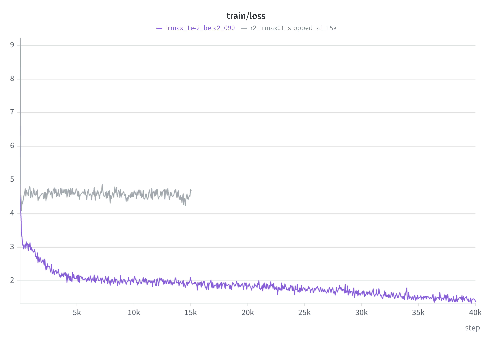
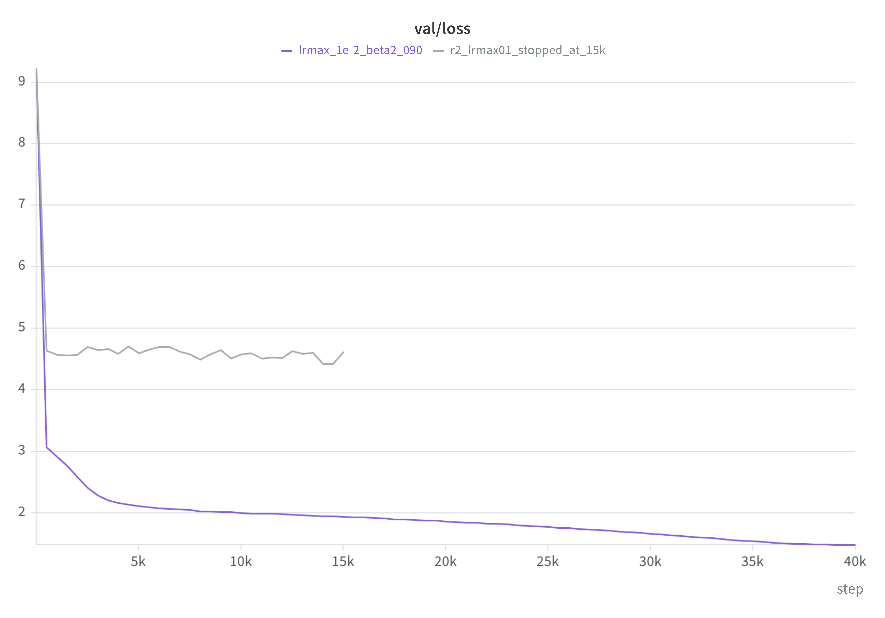
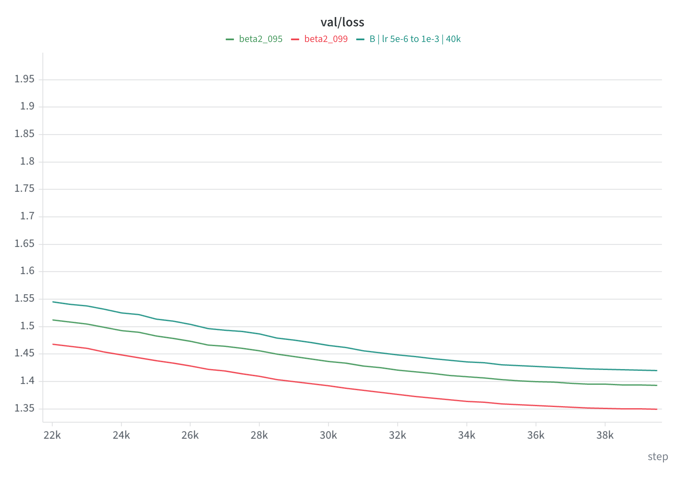
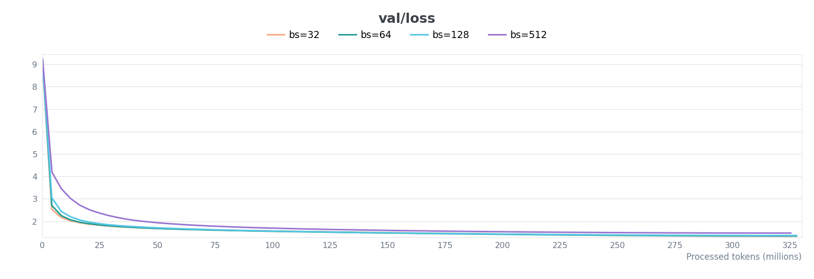
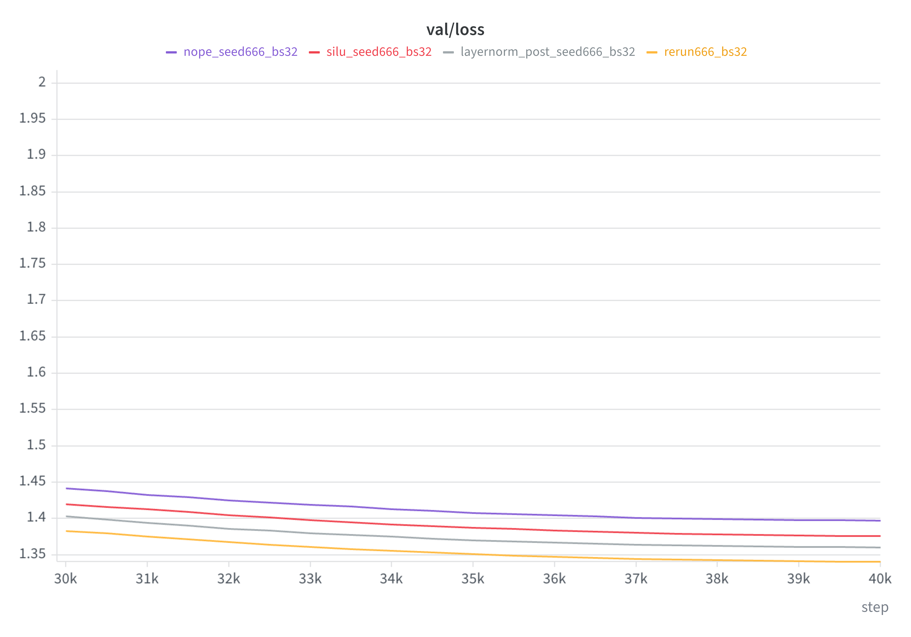

# Albation notes

## 7.2 ablations:
### lr tune

I've ran locally on mps first, had 2 runs, each showed how much time does it take to train locally:
1) 40M tokens, ~1.9253 val loss and ~48min of run, w&b link: https://forge.coreweave.com/wandb/surkovvv/cs336-hw1/runs/1g3kwk8v
2) 327M tokens, ~1.804 val loss and ~6h12m of run, w&b link: https://forge.coreweave.com/wandb/surkovvv/cs336-hw1/runs/do51lynb

Then, I've ran some lr exps with fixed other params

I've taken some of common ones: context_len = 256, batch_size=32, seed=666, beta1=0.9, eps=1e-8

first 2 runs were with small num of steps(5k) just to understand what it is "good lr":

lr_min=1e-5 → lr_max=3e-4, val_loss = 1,9097, w&b link: https://wandb.ai/surkovvv/cs336-hw1/runs/s3ow8ln9

lr_min=3e-6 → lr_max=1e-4, val_loss = 2,3554, w&b link: https://wandb.ai/surkovvv/cs336-hw1/runs/5krw0c9x

Then, I've understanded that this second range of lr's might be narrow, then I've tested 3 40k-steps runs:

(but Idk why, changed weight_decay 0.01 -> 0.1 and beta2 0.95 -> 0.9)

A: lr_min=5e-6 → lr_max=1e-4, val_loss = 1,6604, w&b link: https://wandb.ai/surkovvv/cs336-hw1/runs/6r29gso4

B: lr_min=5e-6 → lr_max=1e-3, val_loss = 1,4202, w&b link: https://wandb.ai/surkovvv/cs336-hw1/runs/x5gbgrgt

C: lr_min=5e-5 → lr_max=1e-3, val_loss = 1,4247, w&b link: https://wandb.ai/surkovvv/cs336-hw1/runs/71t7cv4t

Here I got the undersanding of max_lr factor: if it's too small(like 1e-4) - we get clear undertraining, the gap is significant

If we're talking about min lr - the difference is not so big, so.. here I've understanded that lr_min=5e-6 → lr_max=1e-3 is quite good choice for other ablations.

### warmup & weight decay tune:

Then I've tried to tweak warmup ratio and weight decay(all on the base of the best lr setup)
I've tried warmup ratios 1% vs 2.5% vs 5%(and planned to try even more if 5% will have succeded, but it was not), and tried weight decays 0.01 and 0.5(I've planned 0.05 though.. just missclicked)

| Exp | Warmup | Weight decay |  `val/loss` | W&B |
| --- | ---: | ---: | ---: | --- |
| B | 400 (1%) | 0,1 | 1,4202 | [run](https://wandb.ai/surkovvv/cs336-hw1/runs/x5gbgrgt) |
| 1 | 1 000 (2,5%) | 0,01 | 1,4368 | [run](https://wandb.ai/surkovvv/cs336-hw1/runs/kwa9g2g4) |
| 2 | 2 000 (5%) | 0,01 | 1,4387 | [run](https://wandb.ai/surkovvv/cs336-hw1/runs/6cfrxil6) |
| 3 | 1 000 (2,5%) | 0,5 | 1,4630 | [run](https://wandb.ai/surkovvv/cs336-hw1/runs/1wduc339) |
| 4 | 2 000 (5%) | 0,5 | 1,4639 | [run](https://wandb.ai/surkovvv/cs336-hw1/runs/tn0sj0c1) |

Here I understood that in my amount of compute, these tweaks are not so worthy and kept my defaults.

### border of lr tune

Also, I've made 2 ablations to understand the border of the stability for lr's:
| Exp | Warmup | Weight decay |  `val/loss` | W&B |
| --- | ---: | ---: | ---: | --- |
| LARGE LR max=`1e-2` | 400 | 0,1 | **1,4795** | [run](https://wandb.ai/surkovvv/cs336-hw1/runs/6nk3ha3v) |
| EXTRA LARGE LR max=`1e-1` | 400 | 0,1  | **4,6210** (on stop) | [run](https://wandb.ai/surkovvv/cs336-hw1/runs/hfe4nbua) |

1e-1 run seemed not to train for a while. 1e-2 feels better, but the diff is noticeable. I could try something in the middle, btw.

| Train loss | Validation loss |
| :---: | :---: |
|  |  |

### beta2 tune:

Then, I've remembered bout beta2 numbers in some literature(or even in the pdf text of HW): 0.999 or smth, I've decided to ablate this thing too:

| beta2 value | `val/loss` | W&B |
| --- | ---: | --- |
| 0,9 | 1,4202 | [run](https://wandb.ai/surkovvv/cs336-hw1/runs/x5gbgrgt) |
| 0,95 | 1,3928 | [run](https://wandb.ai/surkovvv/cs336-hw1/runs/i4kmabd0) |
| 0,99 | 1,3492 | [run](https://wandb.ai/surkovvv/cs336-hw1/runs/5r6wz1xx) |

Nice loss upgrade! I've took it with me as the part of the best params: the bigger beta2 - the better loss(in my concrete setup).

### seed tune:

Also, I've tried other seed too(for the best run over previous):
Seed = 2026, loss 1,3470, [run](https://wandb.ai/surkovvv/cs336-hw1/runs/vtl214s2)
Seed13666,  1,3483,  [run](https://wandb.ai/surkovvv/cs336-hw1/runs/k9bj8u6k)

These runs give me understanding that seed=666 is not just lucky one, our trainings are quite stable.

### batch size tune:

Finally, I've tried to tweak batch sizes: 
(here I got some misses cuz didn't have different param for val batch size, therefore got unconsistent numbers as val loss, made some code edits)

Also, I've tried to run bs=1, checked the time.. ~20h, and stopped the training: https://forge.coreweave.com/wandb/surkovvv/cs336-hw1/runs/vgkzd6jo?nw=nwusersurkovvv

| Batch | steps/с | tokens/с | time ~328M tokens | full `val/loss` |
| ---: | ---: | ---: | ---: | ---: |
| 32 | 19,3 | 158k | 34min 34 s | **1,3354** |
| 64 | 10,3 | 170k | 32min 13 сs | 1,3458 |
| 128 | 4,9 | 159k | 34min 22 s | 1,3683 |
| 512 | 1,4 | **180k** | **30min 20 s** | 1,4768 |

full `val/loss` means we took around the same number of tokens as there are in the all val set. 
Here, we can clearly see that even though the largest batch size(512) run is quicker in terms of tokens/sec, but.. the quality is not about the speed.

## 7.3 ablations:

Plan:
1. Layer normalization:
    1.1 no rmsnorm
    1.2 post-norm
2. NoPE
3. SiLU

### Layer norm
First run with best previously choosed lr range(5e-6, 1e-3) crashed due to the NaN's in loss:
w&b run: https://forge.coreweave.com/wandb/surkovvv/cs336-hw1/runs/jneji0dt?nw=nwusersurkovvv
that's why I've picked some lower lr_max = 1e-4, it succeded, but has obviously higher final val_loss: 1.69326, w&b run: https://forge.coreweave.com/wandb/surkovvv/cs336-hw1/runs/i5tvxvz5?nw=nwusersurkovvv

Then, I tried post-norm setting, the result is a little bit worse compared to the pre-norm: 1.35454(vs 1.33539), w&b run: https://forge.coreweave.com/wandb/surkovvv/cs336-hw1/runs/xkstkzzk?nw=nwusersurkovvv

### NoPE

NoPE implementation required the least code modifications, but gives worse results: 1.39174 val loss, w&b run: https://forge.coreweave.com/wandb/surkovvv/cs336-hw1/runs/tpjfbam3?nw=nwusersurkovvv

### SiLU

For SiLU implementation, I've used only 2 matricies insead of 3, so I increased d_ff to 4 * d_model to match the param's number.

SiLU run seems promising, but at the end gives worse final val loss: 1.36877, w&b run: https://forge.coreweave.com/wandb/surkovvv/cs336-hw1/runs/h74vtt0b?nw=nwusersurkovvv

